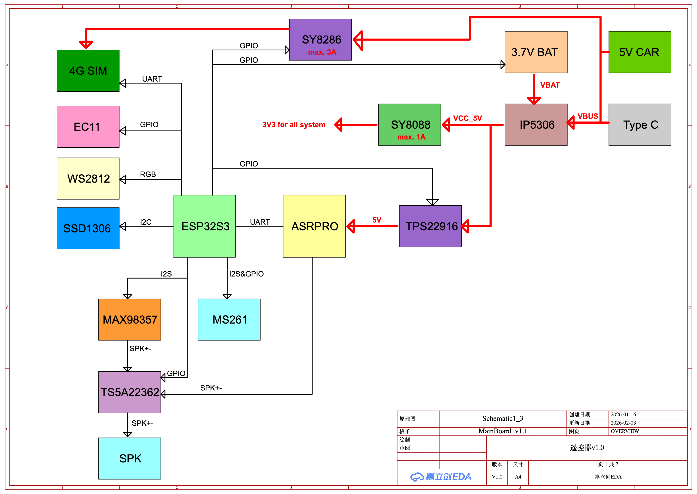
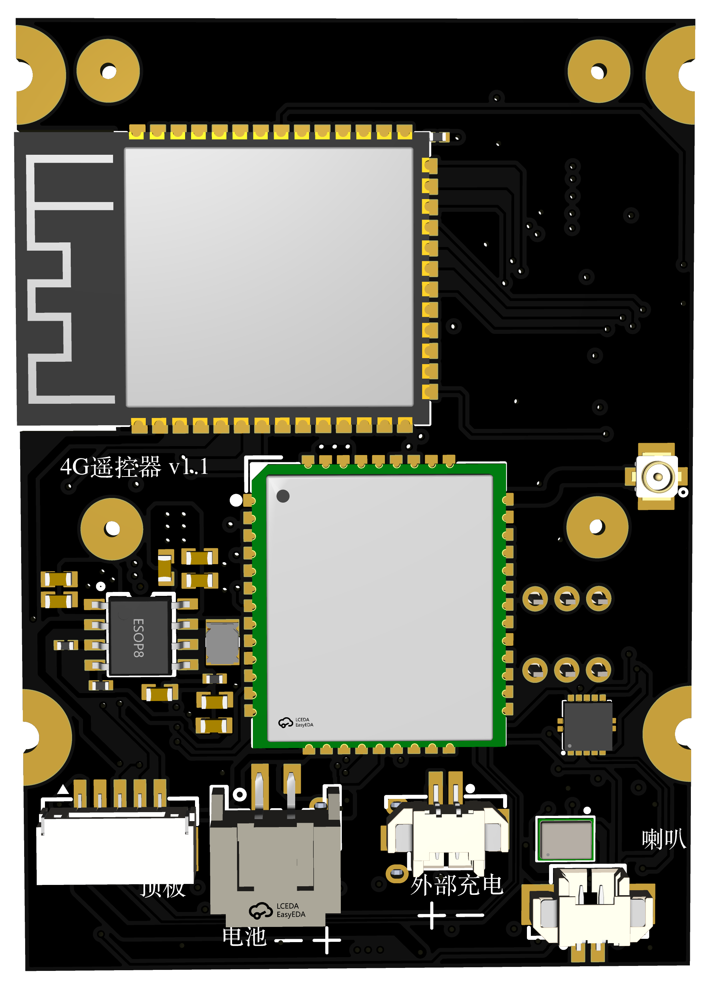
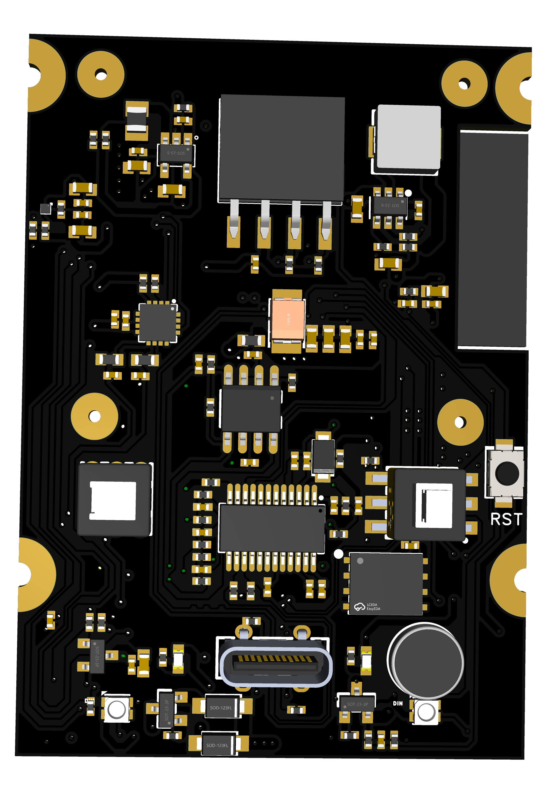
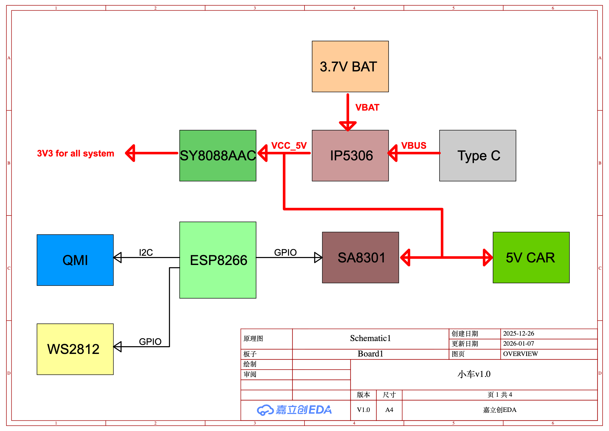
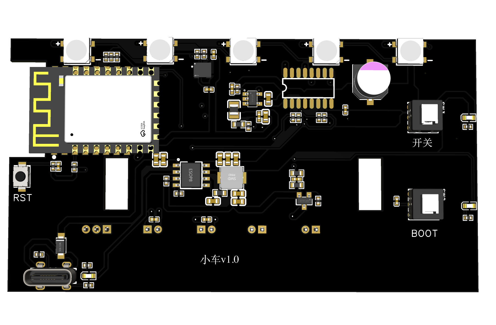
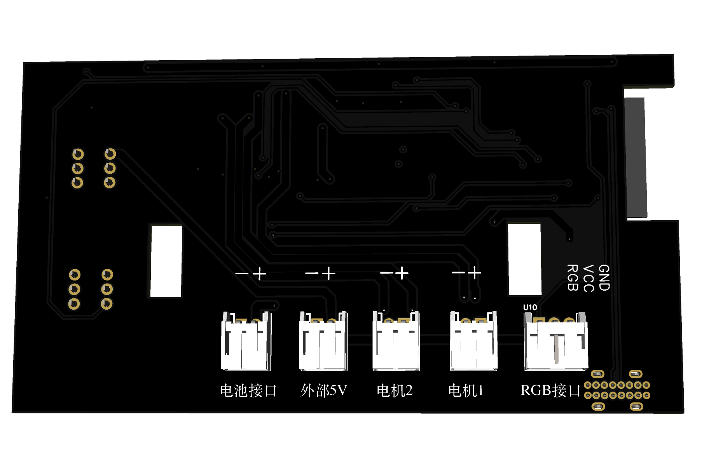

# 4G-remote-control-car

## Remote-Controller

    

This is a **dual-MCU remote controller PCB** designed for wireless control and voice interaction.

### MCU Architecture

- **ESP32-S3 (Main MCU)**  
  Responsible for controlling peripherals, including:
  - 4G cellular module  
  - Rotary encoder  
  - SSD1306 OLED display  
  - Microphone  
  - Speaker  

- **ASRPRO (Tianwen MCU)**  
  A dedicated MCU with excellent **speech recognition capabilities**, used specifically for voice processing.

### Audio Architecture

- Both MCUs **share a single speaker**
- Speaker selection is handled by a **TS5A22363 analog switch**
- Ensures **no contention** between the two MCUs during operation

### Power Supply Design

The board supports **three power input sources**:

- **5V via USB**
- **3.7V Li-ion battery**
- **External 5V input**

Power protection features include:

- **Reverse current protection with Diode**
- **Reverse polarity protection with PMOS**

### Power Management

- Battery charging and discharging management is implemented using the **IP5306**.
- Two **load switch ICs** are used to implement both **hardware and software power control**
- Power to the **ASRPRO** and **4G module** can be completely shut down when not in use, reducing power consumption

### Cellular Connectivity

- The 4G module is paired with an **eSIM chip**
- Enables **true always-on cellular connectivity** without the need for a physical SIM card

  
  

## Car

    

### MCU Architecture

- **ESP8266**  
  Responsible for controlling peripherals, including:
  - H-Bridge  
  - 6-Axis-IMU  
  - WS2812  

  
  

